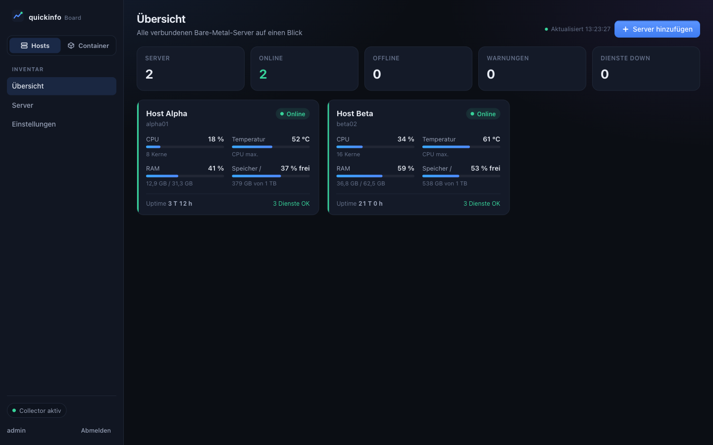
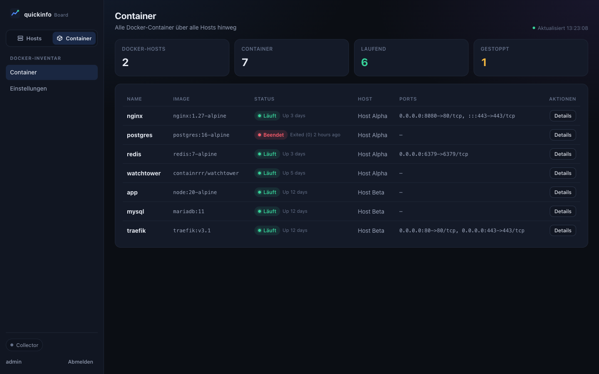
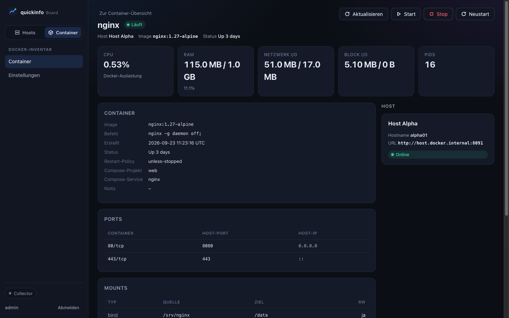

# Docker-Multi-Host-Ansicht

Das quickinfo Board bündelt Docker-Container **über mehrere Docker-Hosts hinweg** in einer
gemeinsamen Ansicht – unabhängig davon, auf welchem Host ein Container läuft. Das Konzept ist an
bekannte Virtualisierungs-Oberflächen wie **VMware vSphere** oder **Proxmox VE** angelehnt:

- links eine umschaltbare Navigation zwischen **Host-** und **Container-Ansicht**,
- eine aggregierte Inventar-Liste aller Container,
- die **Host-Zuordnung** eines Containers erscheint in der Detailansicht **rechts**.

## Voraussetzungen

1. Jeder Docker-Host läuft eine [quickinfo](https://github.com/dareinelt/quickinfo)-Instanz, die die
   Docker-Endpunkte unter `/api/v1/docker/*` (Bearer-Authentifizierung) bereitstellt.
2. Der Host ist im Board als Node gekoppelt (siehe README, Abschnitt „Eine quickinfo-Instanz koppeln“).
3. Der Collector hat mindestens einen Durchlauf absolviert (`COLLECTOR_INTERVAL`), damit die
   Container in den Cache (`node_containers`) geschrieben werden.

> Die Aggregation erfolgt **über alle aktiven Nodes** (`n.enabled = 1`). Ein Node, der gerade keine
> Container liefert, taucht in der Container-Ansicht nicht als Docker-Host auf.

## Ansichten

### Host-Ansicht

Die Standard-Ansicht zeigt das bekannte Server-Grid (eine Kachel je Node). Der Umschalter oben in der
Sidebar wechselt zur Container-Ansicht.



### Container-Ansicht

Die Container-Ansicht zeigt **alle Container aller Hosts** in einer Tabelle:

- **Name**, **Image**, **Status** (mit Farbindikator Läuft/Beendet),
- **Host** – verlinkt zur jeweiligen Node,
- **Ports** – formatiert aus den Docker-Port-Mappings (leer = `–`),
- **Aktionen** – Sprung in die Detailansicht.

Container lassen sich logisch in **benutzerdefinierte Ordner** sortieren. Jeder Ordner erscheint als
eigene Gruppe inkl. Container-Anzahl; daneben gibt es immer den Bereich **„Nicht zugeordnet“**. Über
die Schaltfläche **„Neuer Ordner“** wird ein Ordner angelegt, über die Icons am Ordnerkopf lässt er
sich umbenennen oder löschen. Das Sortieren erfolgt per **Drag & Drop**: einen Container am Griff
(⠿) aufnehmen und auf einen Ordner ziehen. Die Zuordnung wird serverseitig persistiert und überlebt
Container-Neustarts sowie Collector-Polls.

Die Kopfkarten fassen die Summen zusammen: Anzahl Docker-Hosts, Container, laufende und gestoppte
Container.



### Detailansicht

Die Detailansicht eines Containers kombiniert Live-Daten der Node:

- **KPIs:** CPU, RAM, Netzwerk-I/O, Block-I/O, PIDs (aus `/docker/containers/{name}/stats`),
- **Container-Inspektion:** Image, Befehl, Erstellt, Status, Restart-Policy, Compose-Projekt/-Service,
  Notiz (aus `/docker/containers/{name}`),
- **Ports, Mounts, Netzwerke, Labels**,
- **Aktionsleiste:** Aktualisieren, Start, Stop, Neustart.

Rechts erscheint die **Host-Zuordnung**: Name, Hostname, URL und Online-Status des betreibenden
Servers.



## Datenfluss

```mermaid
flowchart LR
    N1[Docker-Host A<br/>quickinfo] -->|GET /api/v1/docker/containers| C[Collector]
    N2[Docker-Host B<br/>quickinfo] -->|GET /api/v1/docker/containers| C
    C -->|Cache| DB[(MariaDB<br/>node_containers)]
    DB --> A[Board API<br/>/api/containers]
    A -->|GET /api/containers| UI[Frontend<br/>Container-Ansicht]
    UI -->|GET /api/containers/&#123;node&#125;/&#123;id&#125;<br/>POST start/stop/restart| A
    A -->|Live| N1
    A -->|Live| N2
```



- **Collector:** pollt jede Node, ruft deren Container-Liste ab und schreibt sie in `node_containers`
  (mit `node_id` als Herkunfts-Markierung). Container werden per `(node_id, container_id)` aktualisiert,
  veraltete Einträge entfernt.
- **Board API:** `/api/containers` liefert die aggregierte Liste aus dem Cache. Detail und Aktionen
  werden **live** gegen die jeweilige Node abgefragt (nicht aus dem Cache).

## REST-Endpunkte

| Methode | Pfad | Beschreibung |
|---|---|---|
| GET | `/api/containers` | Aggregierte Container aller Docker-Hosts (inkl. Host-Zuordnung, Summen, Ordner) |
| GET | `/api/containers/{node}/{id}` | Container-Detail (Host-Zuordnung, Live-Inspektion + Stats) |
| POST | `/api/containers/{node}/{id}/{start\|stop\|restart}` | Container-Aktion auf der Node |
| GET | `/api/container-groups` | Liste der benutzerdefinierten Ordner (inkl. Container-Anzahl) |
| POST | `/api/container-groups` | Ordner anlegen (Body: `{"name": "…"}`) |
| PUT | `/api/container-groups/{id}` | Ordner umbenennen (Body: `{"name": "…"}`) |
| DELETE | `/api/container-groups/{id}` | Ordner löschen (enthaltene Container werden freigegeben) |
| POST | `/api/containers/{node}/{id}/group` | Container einem Ordner zuweisen (Body: `{"group_id": 1}` bzw. `null` zum Entfernen) |

`{node}` ist die `nodes.id`, `{id}` die Docker-Container-ID. Die aggregierte Container-ID im Frontend
ist `"{node}:{id}"`, die Route dementsprechend `#/container/{node}/{id}`.

Beispiel-Antwort von `GET /api/containers`:

```json
{
  "containers": [
    {
      "id": "1:a1b2c3d4e5f6",
      "node_id": 1,
      "container_id": "a1b2c3d4e5f6",
      "name": "nginx",
      "image": "nginx:1.27-alpine",
      "state": "running",
      "status": "Up 3 days",
      "ports": [{"private": 80, "public": 8080, "type": "tcp", "ip": "0.0.0.0"}],
      "group_id": 1,
      "host": {
        "id": 1,
        "name": "Host Alpha",
        "hostname": "alpha01",
        "url": "https://alpha01:8443",
        "status": "online"
      }
    }
  ],
  "hosts": [
    {
      "id": 1,
      "name": "Host Alpha",
      "container_count": 4,
      "running": 3
    }
  ],
  "groups": [
    {
      "id": 1,
      "name": "Produktion",
      "sort_order": 0,
      "container_count": 2
    }
  ],
  "totals": {
    "hosts": 2,
    "containers": 7,
    "running": 6,
    "stopped": 1
  }
}
```

## Datenmodell

Tabelle `node_containers`:

| Spalte | Typ | Bedeutung |
|---|---|---|
| `node_id` | INT UNSIGNED | FK auf `nodes.id` (Herkunfts-Host), `ON DELETE CASCADE` |
| `container_id` | VARCHAR(64) | Docker-Container-ID |
| `name` | VARCHAR(255) | Container-Name |
| `image` | VARCHAR(255) | Image |
| `state` | VARCHAR(32) | z. B. `running`, `exited` |
| `status` | VARCHAR(255) | Docker-Statustext (z. B. `Up 3 days`) |
| `ports` | TEXT | JSON-kodierte Port-Mappings |
| `updated_at` | INT UNSIGNED | Zeitstempel des letzten Poll |

Primärschlüssel: `(node_id, container_id)`.

Tabelle `container_groups` (benutzerdefinierte Ordner):

| Spalte | Typ | Bedeutung |
|---|---|---|
| `id` | INT UNSIGNED | Primärschlüssel (AUTO_INCREMENT) |
| `name` | VARCHAR(128) | Ordnername (eindeutig) |
| `sort_order` | INT | Sortierung |
| `created_at` | INT UNSIGNED | Zeitstempel |

Tabelle `container_group_items` (Zuordnung Container → Ordner):

| Spalte | Typ | Bedeutung |
|---|---|---|
| `node_id` | INT UNSIGNED | FK auf `nodes.id`, `ON DELETE CASCADE` |
| `container_id` | VARCHAR(64) | Docker-Container-ID |
| `group_id` | INT UNSIGNED | FK auf `container_groups.id`, `ON DELETE CASCADE` |

Primärschlüssel: `(node_id, container_id)`. Die Zuordnung ist bewusst vom flüchtigen
`node_containers`-Cache getrennt, damit sie Container-Neustarts und Collector-Polls überlebt.
